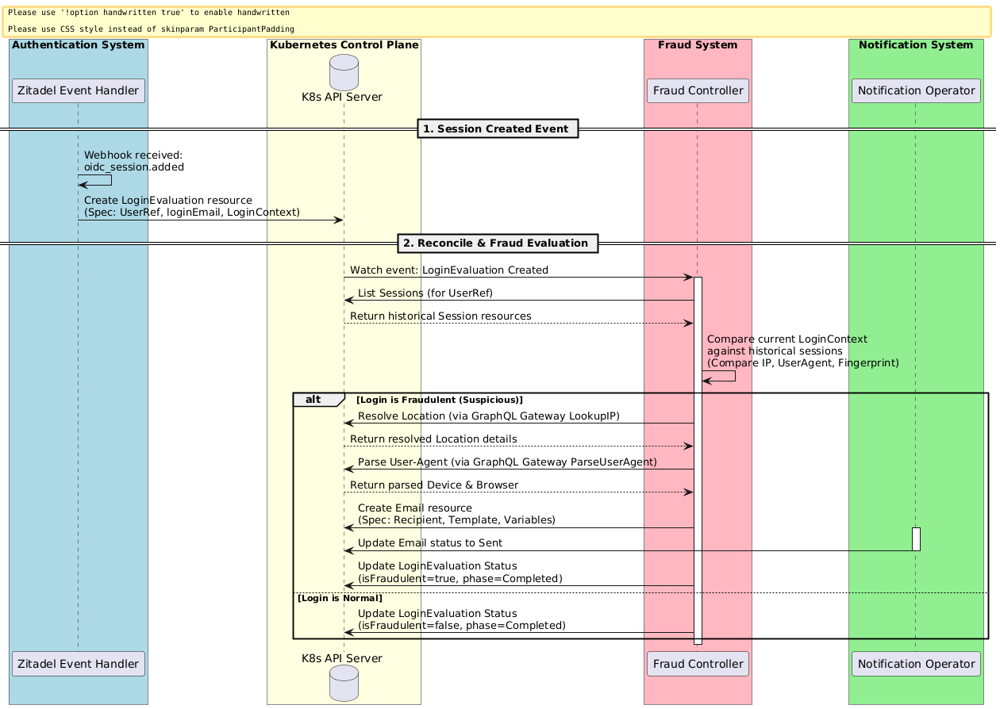

<!--
Inspired by https://github.com/kubernetes/enhancements/tree/master/keps/NNNN-kep-template

Goals are aligned in principle with those described at https://github.com/kubernetes/enhancements/blob/master/keps/sig-architecture/0000-kep-process/README.md

Recommended reading:
  - https://developers.google.com/tech-writing
-->

<!--
**Note:** When your Enhancement is complete, all of these comment blocks should be removed.

To get started with this template:

- [ ] **Make a copy of this template directory.**
  Copy this template into the desired path and name it `short-descriptive-title`.
- [ ] **Fill out this file as best you can.**
  At minimum, you should fill in the "Summary" and "Motivation" sections.
  These should be easy if you've preflighted the idea of the Enhancement with the
  appropriate stakeholders.
- [ ] **Create a PR for this Enhancement.**
  Assign it to stakeholders who are sponsoring this process.
- [ ] **Merge early and iterate.**
  Avoid getting hung up on specific details and instead aim to get the goals of
  the Enhancement clarified and merged quickly. The best way to do this is to just
  start with the high-level sections and fill out details incrementally in
  subsequent PRs.

Just because a Enhancement is merged does not mean it is complete or approved. Any Enhancement
marked as `provisional` is a working document and subject to change. You can
denote sections that are under active debate as follows:

```
<<[UNRESOLVED optional short context or usernames ]>>
Stuff that is being argued.
<<[/UNRESOLVED]>>
```

When editing RFCs, aim for tightly-scoped, single-topic PRs to keep discussions
focused. If you disagree with what is already in a document, open a new PR
with suggested changes.

One Enhancement corresponds to one "feature" or "enhancement" for its whole lifecycle.
You do not need a new Enhancement to move from beta to GA, for example. If
new details emerge that belong in the Enhancement, edit the Enhancement. Once a feature has
become "implemented", major changes should get new RFCs.

The canonical place for the latest set of instructions (and the likely source
of this file) is [here](/docs/rfcs/template/README.md).

**Note:** Any PRs to move a Enhancement to `implementable`, or significant changes once
it is marked `implementable`, must be approved by each of the Enhancement approvers.
If none of those approvers are still appropriate, then changes to that list
should be approved by the remaining approvers and/or the owning SIG (or
SIG Architecture for cross-cutting RFCs).
-->

# Fraudulent Login Evaluation

<!--
This is the title of your Enhancement. Keep it short, simple, and descriptive. A good
title can help communicate what the Enhancement is and should be considered as part of
any review.
-->

<!--
A table of contents is helpful for quickly jumping to sections of a Enhancement and for
highlighting any additional information provided beyond the standard Enhancement
template.
-->

- [Summary](#summary)
- [Motivation](#motivation)
  - [Goals](#goals)
  - [Non-Goals](#non-goals)
- [Proposal](#proposal)
  - [User Stories (Optional)](#user-stories-optional)
  - [Notes/Constraints/Caveats (Optional)](#notesconstraintscaveats-optional)
  - [Risks and Mitigations](#risks-and-mitigations)
- [Design Details](#design-details)
- [Production Readiness Review Questionnaire](#production-readiness-review-questionnaire)
  - [Feature Enablement and Rollback](#feature-enablement-and-rollback)
  - [Rollout, Upgrade and Rollback Planning](#rollout-upgrade-and-rollback-planning)
  - [Monitoring Requirements](#monitoring-requirements)
  - [Dependencies](#dependencies)
  - [Scalability](#scalability)
  - [Troubleshooting](#troubleshooting)
- [Implementation History](#implementation-history)
- [Drawbacks](#drawbacks)
- [Alternatives](#alternatives)
- [Infrastructure Needed (Optional)](#infrastructure-needed-optional)

## Summary

<!--
This section is incredibly important for producing high-quality, user-focused
documentation such as release notes or a development roadmap. It should be
possible to collect this information before implementation begins, in order to
avoid requiring implementors to split their attention between writing release
notes and implementing the feature itself. Enhancement editors should help to ensure
that the tone and content of the `Summary` section is useful for a wide audience.

A good summary is probably at least a paragraph in length.

Both in this section and below, follow the guidelines of the [documentation
style guide]. In particular, wrap lines to a reasonable length, to make it
easier for reviewers to cite specific portions, and to minimize diff churn on
updates.

[documentation style guide]: https://github.com/kubernetes/community/blob/master/contributors/guide/style-guide.md
-->

This enhancement proposes shifting the responsibility of evaluating suspicious user logins and alerting users of anomalous access from the identity provider layer to the central fraud detection system. 

Instead of the authentication gateway performing inline fraud risk checks and sending email alerts synchronously, it will delegate login event data directly to the fraud detection service. The fraud service then evaluates the login context against the user's historical session patterns to determine if it is anomalous (e.g., a new IP, browser, or device). When a suspicious login is identified, the fraud system automatically enriches the metadata with geographic location and device details and sends a security alert to the user.

## Motivation

<!--
This section is for explicitly listing the motivation, goals, and non-goals of
this Enhancement.  Describe why the change is important and the benefits to users.
-->

Currently, the authentication provider is coupled with security and fraud rules. Evaluating whether a login context (IP, User-Agent, or Fingerprint) is anomalous requires knowledge of session histories, geolocation lookups, and user-agent analysis. Housing this capability inside the authentication gateway introduces several disadvantages:
- **Feature Coupling**: The authentication system should focus exclusively on validating user credentials, rather than performing geolocation enrichment and complex risk analysis.
- **Fragmented Fraud Policies**: Security policies and risk assessment logic are split across different systems, making it difficult to maintain and audit consistently.
- **Lack of Central Audit Logging**: Suspicious login decisions are made in-memory and logged, but they are not stored as persistent audit records for security administrators.

By centralizing login evaluation within the fraud system, we establish a clean separation of responsibilities, improve the auditability of security decisions, and ensure a unified security and fraud policy engine.

### Goals

<!--
List the specific goals of the Enhancement. What is it trying to achieve? How will we
know that this has succeeded?
-->

- Decouple the login flow from fraud and alert policies.
- Centralize login risk assessment within the dedicated fraud detection system.
- Utilize historical user session characteristics to recognize anomalous login attempts.
- Provide persistent audit records for all evaluated login attempts.
- Deliver automated, metadata-enriched security notifications to users upon detection of suspicious logins.

### Non-Goals

<!--
What is out of scope for this Enhancement? Listing non-goals helps to focus discussion
and make progress.
-->

- Modifying the Zitadel event delivery system or changing Zitadel webhook payloads.
- Replacing or modifying the existing `FraudEvaluation` pipeline, which focuses on long-term user risk profiles rather than transient login events.
- Creating an independent geo-IP database; the fraud operator will leverage the existing GraphQL gateway.

## Proposal

<!--
This is where we get down to the specifics of what the proposal actually is.
This should have enough detail that reviewers can understand exactly what
you're proposing, but should not include things like API designs or
implementation. What is the desired outcome and how do we measure success?.
The "Design Details" section below is for the real
nitty-gritty.
-->

We propose an event-driven flow for evaluating user login security:

1. **Login Event Propagation**: Upon a new user login, the authentication system publishes a login attempt record containing the login context (IP, User-Agent, device fingerprint, and timestamp).
2. **Historical Analysis**: The fraud system receives the login event and queries the historical record of that user's sessions.
3. **Anomalous Context Detection**: The fraud system checks if the incoming login context is new or unseen compared to the user's past active sessions.
4. **Metadata Enrichment**: If the login is flagged as anomalous, the fraud system translates the raw client IP and User-Agent strings into human-readable geographic locations and device descriptions.
5. **Security Alerting**: The fraud system triggers a high-priority notification to alert the user of the suspicious access attempt.
6. **Audit Persistence**: The outcome of the evaluation (whether flagged or not) is recorded in the fraud system's audit logs.

### User Stories (Optional)

<!--
Detail the things that people will be able to do if this Enhancement is implemented.
Include as much detail as possible so that people can understand the "how" of
the system. The goal here is to make this feel real for users without getting
bogged down.
-->

#### Story 1
As a User, I want to receive an email alert when a new login occurs on my account from a device or location I have not used before, so that I can secure my account.

#### Story 2
As a Security Admin, I want to query a list of login evaluations (`kubectl get loginevaluations`) to see all evaluated login events, their details, and whether they were flagged as fraudulent.

### Notes/Constraints/Caveats (Optional)

<!--
What are the caveats to the proposal?
What are some important details that didn't come across above?
Go in to as much detail as necessary here.
This might be a good place to talk about core concepts and how they relate.
-->

- **Race Conditions**: When a new session is added, `Session` resources in the cluster may be updated asynchronously. The fraud controller must ignore the current session itself when looking at historical data to avoid comparing a login to itself.
- **Gateway Availability**: Geolocation and user-agent parsing depend on the GraphQL gateway. If the gateway is down, the system should fall back gracefully to raw values.

### Risks and Mitigations

<!--
What are the risks of this proposal, and how do we mitigate? Think broadly.
For example, consider both security and how this will impact the larger
software ecosystem.

How will security be reviewed, and by whom?

How will UX be reviewed, and by whom?

Consider including folks who also work outside of your immediate team.
-->

- **Resource Proliferation**: A high volume of login events could produce many `LoginEvaluation` resources, leading to API server stress.
  *Mitigation*: Implement a garbage-collection policy (e.g., TTL controller or owner references) to delete old `LoginEvaluation` resources after a configured retention period.
- **Performance Overhead**: Fetching session lists and performing HTTP lookups during reconciliation can delay evaluation.
  *Mitigation*: Use client caching for `Session` lookups, run network requests concurrently, and handle transient errors with proper exponential backoff retries.

## Design Details

<!--
This section should contain enough information that the specifics of your
change are understandable. This may include API specs (though not always
required) or even code snippets. If there's any ambiguity about HOW your
proposal will be implemented, this is the place to discuss them.
-->

### LoginEvaluation CRD Schema

The new custom resource `LoginEvaluation` will represent a login event under the `fraud.miloapis.com` group.

```yaml
apiVersion: fraud.miloapis.com/v1alpha1
kind: LoginEvaluation
metadata:
  name: login-eval-sample
  namespace: fraud-system
spec:
  # Reference to the User resource
  userRef:
    name: user-zitadel-id-123
  # Optional email address used for this specific login attempt (essential when users can log in with different emails/OIDC providers)
  loginEmail: "user@example.com"
  # Context details about the login attempt
  loginContext:
    sessionID: sess-98765
    ip: 203.0.113.88
    userAgent: "Mozilla/5.0 (Macintosh; Intel Mac OS X 10_15_7) AppleWebKit/537.36 (KHTML, like Gecko) Chrome/120.0.0.0 Safari/537.36"
    fingerprintID: fp-ab12cd34
    createdAt: "2026-06-17T16:11:00Z"
status:
  # Current phase: Pending, Running, Completed, Error
  phase: Completed
  # Evaluation result
  isFraudulent: true
  # Status conditions representing evaluation steps
  conditions:
    - type: Ready
      status: "True"
      lastTransitionTime: "2026-06-17T16:11:03Z"
      reason: EvaluationCompleted
      message: "Login evaluated and processed successfully."
    - type: UserRefValid
      status: "True"
      lastTransitionTime: "2026-06-17T16:11:02Z"
      reason: UserRefExists
      message: "Subject user-zitadel-id-123 is valid and exists."
    - type: NotificationSent
      status: "True"
      lastTransitionTime: "2026-06-17T16:11:03Z"
      reason: NotificationDispatched
      message: "Alert notification created for delivery."
```

### Sequence Diagram



### Evaluation Logic & Flow

1. **Triggering**: The Zitadel handler receives the `oidc_session.added` payload. Instead of running analysis logic, it builds a `LoginEvaluation` resource and writes it to the Kubernetes API.
2. **Session Retrieval**: The fraud controller uses the UserRef from the spec to retrieve all existing `Session` resources under the `identity.miloapis.com/v1alpha1` group.
3. **Suspicious Context Check**:
   - The controller filters out the current session ID to avoid checking against itself.
   - It checks if the current IP address, User-Agent string, or fingerprint ID matches any historical session records.
   - If *none* of the historical sessions match the current IP, User-Agent, or fingerprint, the login is marked as suspicious.
4. **Geolocation and UA Parsing**:
   - The fraud controller calls the external GraphQL Gateway to get human-readable location details for the IP.
   - The user agent string is resolved to determine the OS (device) and Browser.
5. **Notification**:
   - If flagged, a high-priority `Email` resource is created in the notification namespace, targeting the recipient user with variables: `UserName`, `Email`, `Location`, `SignInTime`, `Browser`, `Device`, and `IpAddress`.

## Production Readiness Review Questionnaire

<!--

Production readiness reviews are intended to ensure that features are observable,
scalable and supportable; can be safely operated in production environments, and
can be disabled or rolled back in the event they cause increased failures in
production.

See more in the PRR Enhancement at https://git.k8s.io/enhancements/keps/sig-architecture/1194-prod-readiness.

The production readiness review questionnaire must be completed and approved
for the Enhancement to move to `implementable` status and be included in the release.
-->

### Feature Enablement and Rollback

<!--
This section must be completed when targeting alpha to a release.
-->

#### How can this feature be enabled / disabled in a live cluster?

<!--
Pick one of these and delete the rest.
-->

- [ ] Feature gate
  - Feature gate name:
  - Components depending on the feature gate:
- [ ] Other
  - Describe the mechanism:
  - Will enabling / disabling the feature require downtime of the control plane?
  - Will enabling / disabling the feature require downtime or reprovisioning of a node?

#### Does enabling the feature change any default behavior?

<!--
Any change of default behavior may be surprising to users or break existing
automations, so be extremely careful here.
-->

#### Can the feature be disabled once it has been enabled (i.e. can we roll back the enablement)?

<!--
Describe the consequences on existing workloads (e.g., if this is a runtime
feature, can it break the existing applications?).

Feature gates are typically disabled by setting the flag to `false` and
restarting the component. No other changes should be necessary to disable the
feature.
-->

#### What happens if we reenable the feature if it was previously rolled back?

#### Are there any tests for feature enablement/disablement?

### Rollout, Upgrade and Rollback Planning

<!--
This section must be completed when targeting beta to a release.
-->

#### How can a rollout or rollback fail? Can it impact already running workloads?

<!--
Try to be as paranoid as possible - e.g., what if some components will restart
mid-rollout?

Be sure to consider highly-available clusters, where, for example,
feature flags will be enabled on some servers and not others during the
rollout. Similarly, consider large clusters and how enablement/disablement
will rollout across nodes.
-->

#### What specific metrics should inform a rollback?

<!--
What signals should users be paying attention to when the feature is young
that might indicate a serious problem?
-->

#### Were upgrade and rollback tested? Was the upgrade->downgrade->upgrade path tested?

<!--
Describe manual testing that was done and the outcomes.
Longer term, we may want to require automated upgrade/rollback tests, but we
are missing a bunch of machinery and tooling and can't do that now.
-->

#### Is the rollout accompanied by any deprecations and/or removals of features, APIs, fields of API types, flags, etc.?

<!--
Even if applying deprecation policies, they may still surprise some users.
-->

### Monitoring Requirements

<!--
This section must be completed when targeting beta to a release.

For GA, this section is required: approvers should be able to confirm the
previous answers based on experience in the field.
-->

#### How can an operator determine if the feature is in use by workloads?

<!--
Ideally, this should be a metric. Operations against the API (e.g., checking if
there are objects with field X set) may be a last resort. Avoid logs or events
for this purpose.
-->

#### How can someone using this feature know that it is working for their instance?

<!--
For instance, if this is an instance-related feature, it should be possible to
determine if the feature is functioning properly for each individual instance.
Pick one more of these and delete the rest.
Please describe all items visible to end users below with sufficient detail so
that they can verify correct enablement and operation of this feature.
Recall that end users cannot usually observe component logs or access metrics.
-->

- [ ] Events
  - Event Reason:
- [ ] API .status
  - Condition name:
  - Other field:
- [ ] Other (treat as last resort)
  - Details:

#### What are the reasonable SLOs (Service Level Objectives) for the enhancement?

<!--
This is your opportunity to define what "normal" quality of service looks like
for a feature.

It's impossible to provide comprehensive guidance, but at the very
high level (needs more precise definitions) those may be things like:
  - per-day percentage of API calls finishing with 5XX errors <= 1%
  - 99% percentile over day of absolute value from (job creation time minus expected
    job creation time) for cron job <= 10%
  - 99.9% of /health requests per day finish with 200 code

These goals will help you determine what you need to measure (SLIs) in the next
question.
-->

#### What are the SLIs (Service Level Indicators) an operator can use to determine the health of the service?

<!--
Pick one more of these and delete the rest.
-->

- [ ] Metrics
  - Metric name:
  - [Optional] Aggregation method:
  - Components exposing the metric:
- [ ] Other (treat as last resort)
  - Details:

#### Are there any missing metrics that would be useful to have to improve observability of this feature?

<!--
Describe the metrics themselves and the reasons why they weren't added (e.g., cost,
implementation difficulties, etc.).
-->

### Dependencies

<!--
This section must be completed when targeting beta to a release.
-->

#### Does this feature depend on any specific services running in the cluster?

<!--
Think about both cluster-level services (e.g. metrics-server) as well
as node-level agents (e.g. specific version of CRI). Focus on external or
optional services that are needed. For example, if this feature depends on
a cloud provider API, or upon an external software-defined storage or network
control plane.

For each of these, fill in the following—thinking about running existing user workloads
and creating new ones, as well as about cluster-level services (e.g. DNS):
  - [Dependency name]
    - Usage description:
      - Impact of its outage on the feature:
      - Impact of its degraded performance or high-error rates on the feature:
-->

### Scalability

<!--
For alpha, this section is encouraged: reviewers should consider these questions
and attempt to answer them.

For beta, this section is required: reviewers must answer these questions.

For GA, this section is required: approvers should be able to confirm the
previous answers based on experience in the field.
-->

#### Will enabling / using this feature result in any new API calls?

<!--
Describe them, providing:
  - API call type (e.g. PATCH workloads)
  - estimated throughput
  - originating component(s) (e.g. Workload, Network, Controllers)
Focusing mostly on:
  - components listing and/or watching resources they didn't before
  - API calls that may be triggered by changes of some resources
    (e.g. update of object X triggers new updates of object Y)
  - periodic API calls to reconcile state (e.g. periodic fetching state,
    heartbeats, leader election, etc.)
-->

#### Will enabling / using this feature result in introducing new API types?

<!--
Describe them, providing:
  - API type
  - Supported number of objects per cluster
  - Supported number of objects per namespace (for namespace-scoped objects)
-->

#### Will enabling / using this feature result in any new calls to the cloud provider?

<!--
Describe them, providing:
  - Which API(s):
  - Estimated increase:
-->

#### Will enabling / using this feature result in increasing size or count of the existing API objects?

<!--
Describe them, providing:
  - API type(s):
  - Estimated increase in size: (e.g., new annotation of size 32B)
  - Estimated amount of new objects: (e.g., new Object X for every existing Pod)
-->

#### Will enabling / using this feature result in increasing time taken by any operations covered by existing SLIs/SLOs?

<!--
Look at the [existing SLIs/SLOs].

Think about adding additional work or introducing new steps in between
(e.g. need to do X to start a container), etc. Please describe the details.

[existing SLIs/SLOs]: https://git.k8s.io/community/sig-scalability/slos/slos.md#kubernetes-slisslos
-->

#### Will enabling / using this feature result in non-negligible increase of resource usage in any components?

<!--
Things to keep in mind include: additional in-memory state, additional
non-trivial computations, excessive access to disks (including increased log
volume), significant amount of data sent and/or received over network, etc.
This through this both in small and large cases, again with respect to the
[supported limits].

[supported limits]: https://git.k8s.io/community//sig-scalability/configs-and-limits/thresholds.md
-->

#### Can enabling / using this feature result in resource exhaustion of some node resources (PIDs, sockets, inodes, etc.)?

<!--
Focus not just on happy cases, but primarily on more pathological cases.

Are there any tests that were run/should be run to understand performance
characteristics better and validate the declared limits?
-->

### Troubleshooting

<!--
This section must be completed when targeting beta to a release.

For GA, this section is required: approvers should be able to confirm the
previous answers based on experience in the field.

The Troubleshooting section currently serves the `Playbook` role. We may consider
splitting it into a dedicated `Playbook` document (potentially with some monitoring
details). For now, we leave it here.
-->

#### How does this feature react if the API server is unavailable?

#### What are other known failure modes?

<!--
For each of them, fill in the following information by copying the below template:
  - [Failure mode brief description]
    - Detection: How can it be detected via metrics? Stated another way:
      how can an operator troubleshoot without logging into a master or worker node?
    - Mitigations: What can be done to stop the bleeding, especially for already
      running user workloads?
    - Diagnostics: What are the useful log messages and their required logging
      levels that could help debug the issue?
      Not required until feature graduated to beta.
    - Testing: Are there any tests for failure mode? If not, describe why.
-->

#### What steps should be taken if SLOs are not being met to determine the problem?

## Implementation History

<!--
Major milestones in the lifecycle of a Enhancement should be tracked in this section.
Major milestones might include:
- the `Summary` and `Motivation` sections being merged, signaling acceptance
- the `Proposal` section being merged, signaling agreement on a proposed design
- the date implementation started
- the first release where an initial version of the Enhancement was available
- the version where the Enhancement graduated to general availability
- when the Enhancement was retired or superseded
-->

- **2026-06-17**: Initial enhancement proposal drafted (Alpha).

## Drawbacks

<!--
Why should this Enhancement _not_ be implemented?
-->

- **Increased API Overhead**: Each user login now triggers at least one additional write to the Kubernetes API server (`LoginEvaluation` creation) and several reads.
- **Dependency on CRD**: If the `LoginEvaluation` CRD is deleted or misconfigured, it breaks the fraud-alert pipeline.

## Alternatives

<!--
What other approaches did you consider, and why did you rule them out? These do
not need to be as detailed as the proposal, but should include enough
information to express the idea and why it was not acceptable.
-->

- **Kafka / Event Bus integration**: Send authentication events directly to a broker like Kafka or RabbitMQ, which the fraud operator listens to. While scalable, it introduces a massive external infrastructure requirement. Kubernetes CRDs offer a simple, native control plane fit for the existing environment.

## Infrastructure Needed (Optional)

<!--
Use this section if you need things from another party. Examples include a
new repos, external services, compute infrastructure.
-->

None.